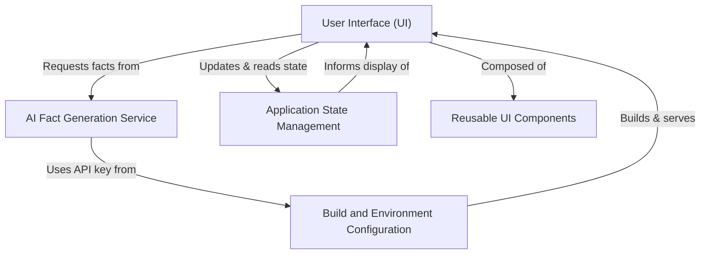

# Tutorial: COSMIC-QUERIES

`COSMIC-QUERIES` is an application designed to provide users with *surprising and mind-blowing physics facts*. It uses an **AI model** (Google Gemini) to generate these facts dynamically. The application features an *intuitive user interface* where you can easily request new facts, and it manages various states like loading and errors to ensure a smooth experience.

## Visual Overview

## Chapters

1. [User Interface (UI)
](01_user_interface__ui__.md)
2. [Application State Management
](02_application_state_management_.md)
3. [AI Fact Generation Service
](03_ai_fact_generation_service_.md)
4. [Reusable UI Components
](04_reusable_ui_components_.md)
5. [Build and Environment Configuration
](05_build_and_environment_configuration_.md)

---
