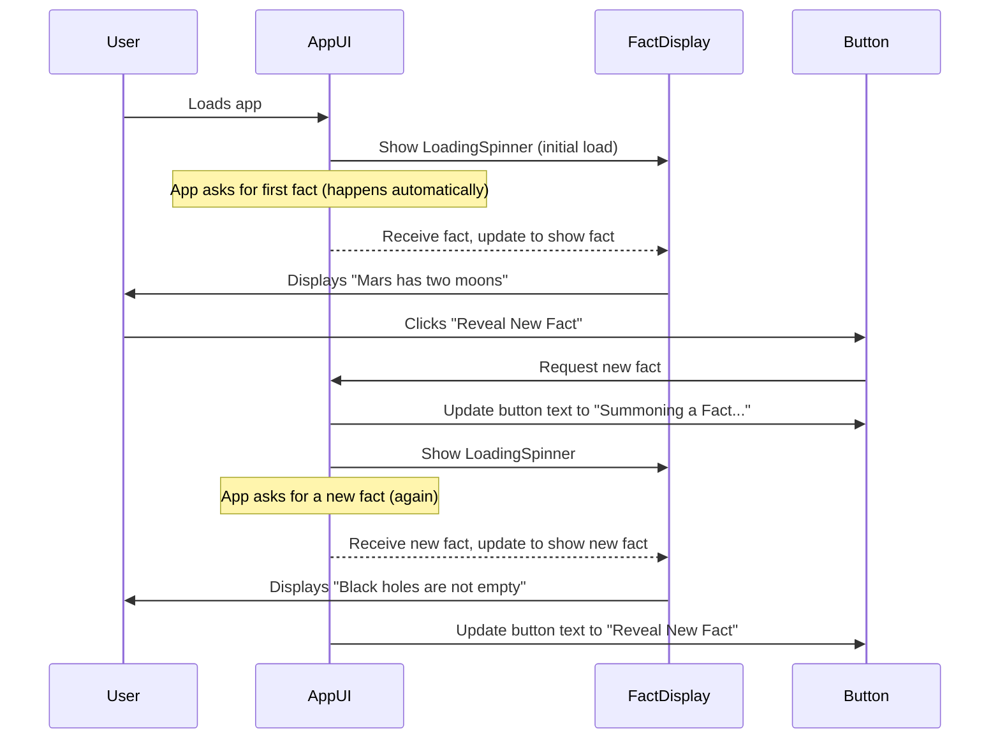

# Chapter 1: User Interface (UI)

Welcome, curious mind, to `COSMIC-QUERIES`! In this adventure, we'll explore how this app works, starting with what you see and interact with.

Imagine `COSMIC-QUERIES` as a powerful spaceship. Every spaceship needs a "cockpit" – a place where the pilot (you!) can see important information and control the ship. In our app, this "cockpit" is what we call the **User Interface**, or **UI** for short.

## What is the User Interface (UI)?

The **User Interface (UI)** is everything you see and interact with on your screen when you use `COSMIC-QUERIES`. It's the visual part of the app. Just like a spaceship's cockpit displays speed, altitude, and fuel levels, our UI shows you:

*   The amazing physics fact generated by our AI.
*   A "loading" animation when we're busy finding a new fact.
*   Any error messages if something goes wrong.
*   A button you can click to request a new fact.

The goal of our UI is to be smooth, clear, and engaging, making your experience of exploring physics wonders truly enjoyable!

## Our Main Mission: Showing You a Fact!

The central mission of `COSMIC-QUERIES` is simple: **to show you a fascinating physics fact and let you ask for another.**

Let's break down how the UI helps us achieve this mission:

1.  **First Look:** When you open the app, the UI quickly shows a spinning animation while it fetches the very first fact.
2.  **Fact Revealed:** Once loaded, the UI displays a cool physics fact in a central box.
3.  **Your Turn to Explore:** Below the fact, you'll see a button. Clicking this button tells the UI, "Hey, I want a new fact!"
4.  **Repeat:** The UI then shows the loading animation again, fetches a new fact, and displays it. If there's a problem, it will display an error message instead.

This simple interaction cycle is managed entirely by the UI.

## How the UI Starts Up (The Canvas)

Before we can "paint" our UI, we need a blank canvas. In web applications, this canvas is usually a simple HTML file.

Look at this part of `index.html`:

```html
<body>
    <div id="root"></div>
<script type="module" src="/index.tsx"></script>
</body>
```
This small snippet of code from `index.html` creates a special placeholder `<div id="root"></div>`. Think of it as the main area where our entire application's UI will be drawn. The `<script>` tag then tells the browser to load our main application code, which will start "drawing" things into this `root` div.

Next, our `index.tsx` file is like the first brush stroke on that canvas. It tells the web browser to "render" (or draw) our main `App` component into the `root` div:

```typescript
import React from 'react';
import ReactDOM from 'react-dom/client';
import App from './App'; // Our main app UI

const rootElement = document.getElementById('root');
if (!rootElement) {
  throw new Error("Could not find root element to mount to");
}

const root = ReactDOM.createRoot(rootElement);
root.render(
  <React.StrictMode>
    <App /> {/* Our entire application UI is here! */}
  </React.StrictMode>
);
```
Here, `ReactDOM.createRoot(rootElement).render(<App />)` is the key line. It's like saying, "Find the `root` div, and put everything defined in our `App` here." So, our `App` component is where all the `COSMIC-QUERIES` UI magic truly begins!

## The Main UI Layout (The Cockpit Sections)

Our app's main UI layout is defined in `App.tsx`. It's like breaking our spaceship's cockpit into different sections:

```typescript
// --- File: App.tsx ---
// ... (imports and helper components like SparklesIcon, LoadingSpinner are here) ...

const App: React.FC = () => {
  // ... (state management, explained in next chapter) ...

  return (
    <div className="min-h-screen bg-black text-white flex flex-col items-center justify-center p-4">
        <header className="text-center">
          <h1 className="text-6xl font-black">Cosmic Queries</h1>
          <p className="text-xl mt-2">Your Daily Dose of Physics Astonishment</p>
        </header>

        <FactDisplay /* props like fact, isLoading, error go here */ />

        <div className="flex justify-center">
          <button
            onClick={/* handles asking for a new fact */}
            disabled={/* controls when button can be clicked */}
          >
             <SparklesIcon className="w-6 h-6 mr-3" />
             <span>{/* Button text like 'Reveal New Fact' */}</span>
          </button>
        </div>
        <footer className="relative z-10 bottom-4 text-center text-gray-500 text-sm mt-10">
            <p>&copy; {new Date().getFullYear()} Santanu Pradhan.</p>
        </footer>
        {/* ... (styles for background and animations are here) ... */}
    </div>
  );
};

export default App;
```
This simplified code from `App.tsx` shows the main structure of our UI. We have:
*   A `<header>` section at the top with the app's title.
*   A `<FactDisplay />` component, which is a special box designed to show the physics fact, loading animation, or error message. We'll look at this next!
*   A `<button>` that users click to get a new fact. Notice the `SparklesIcon` inside the button, adding a visual flair.
*   A `<footer>` at the bottom for copyright information.

These are the main sections of our "cockpit."

### The Fact Display Area (The Main Screen)

The `FactDisplay` component is crucial. It's the "main screen" in our cockpit that changes what it shows based on what the app is doing (loading, showing fact, or showing an error).

```typescript
// --- File: App.tsx (part of) ---
// ... (SparklesIcon, ExclamationTriangleIcon, LoadingSpinner definitions) ...

interface FactDisplayProps {
  fact: string | null;
  isLoading: boolean;
  error: string | null;
}

const FactDisplay: React.FC<FactDisplayProps> = ({ fact, isLoading, error }) => (
  <div className="relative group">
    <div className="relative min-h-[250px] bg-black rounded-lg p-6 flex items-center justify-center text-center">
        {isLoading ? (
          <LoadingSpinner /> // Shows a spinning circle
        ) : error ? (
          <div className="flex flex-col items-center">
            <ExclamationTriangleIcon className="w-12 h-12" /> {/* Warning icon */}
            <p className="font-medium text-lg">{error}</p> {/* Error text */}
          </div>
        ) : (
          <p className="text-xl md:text-2xl font-light text-gray-200">
            {fact} {/* The exciting physics fact! */}
          </p>
        )}
    </div>
  </div>
);
```
Here's how `FactDisplay` works:
*   It takes three pieces of information (called `props`): `fact`, `isLoading`, and `error`.
*   It checks `isLoading`: If `true`, it shows a `LoadingSpinner`.
*   If not `isLoading`, it checks `error`: If there's an `error` message, it shows a `ExclamationTriangleIcon` and the error text.
*   If neither `isLoading` nor `error` is true, it finally shows the `fact`.

This is how the UI adapts to different states of the application.

### The "Reveal New Fact" Button (The Control Panel)

The button is your primary control. It's also part of the `App.tsx` file:

```typescript
// --- File: App.tsx (part of) ---
// ... (inside the App component's return statement) ...

              <button
                onClick={handleGenerateFact} // What happens when you click
                disabled={isLoading}        // When the button cannot be clicked
                className="group relative inline-flex items-center justify-center px-8 py-4 bg-black text-white font-bold rounded-lg"
              >
                 <SparklesIcon className="w-6 h-6 mr-3" />
                 <span className="relative z-10">{isLoading ? 'Summoning a Fact...' : 'Reveal New Fact'}</span>
              </button>
```
*   `onClick={handleGenerateFact}`: This tells the button what to do when clicked. `handleGenerateFact` is a special function that asks for a new fact. (We'll learn more about this in [Application State Management](02_application_state_management_.md)).
*   `disabled={isLoading}`: This makes the button unclickable (greyed out) when the app is `isLoading` a fact. You wouldn't want to spam the button!
*   The text inside the button changes (`'Summoning a Fact...'` or `'Reveal New Fact'`) based on whether the app is currently loading.

## How UI Elements Interact (A Simple Journey)

Let's put it all together with a simple example of a user interacting with the UI:



In this diagram:
1.  When the **User** loads the app, the **AppUI** tells the **FactDisplay** to show a loading spinner.
2.  Once a fact is ready, the **AppUI** updates the **FactDisplay** to show the fact to the **User**.
3.  When the **User** clicks the **Button**, the **Button** tells the **AppUI** that it needs a new fact.
4.  The **AppUI** then updates the **Button**'s text and tells the **FactDisplay** to show the loading spinner again.
5.  After the new fact arrives, the **AppUI** updates the **FactDisplay** with the new fact and changes the **Button**'s text back.

## Conclusion

In this chapter, we explored the **User Interface (UI)** of `COSMIC-QUERIES`. We learned that the UI is the "cockpit" where you interact with the app, seeing facts, loading animations, error messages, and a button to get new content. We saw how `index.html` and `index.tsx` set up the canvas, and how the `App.tsx` file defines the main layout and components like `FactDisplay` and the "Reveal New Fact" button.

We kept things simple by focusing on what you see and interact with. But what makes the UI *change*? How does the `isLoading` or `error` information get to the `FactDisplay` component? That's where **Application State Management** comes in, which we'll dive into in the next chapter!

[Next Chapter: Application State Management](02_application_state_management_.md)

---

<sub><sup>**References**: [[1]](https://github.com/santanu-p/COSMIC-QUERIES/blob/8a26b7fd4124f716cceb7d3148c370d080ff255b/App.tsx), [[2]](https://github.com/santanu-p/COSMIC-QUERIES/blob/8a26b7fd4124f716cceb7d3148c370d080ff255b/index.html), [[3]](https://github.com/santanu-p/COSMIC-QUERIES/blob/8a26b7fd4124f716cceb7d3148c370d080ff255b/index.tsx)</sup></sub>
