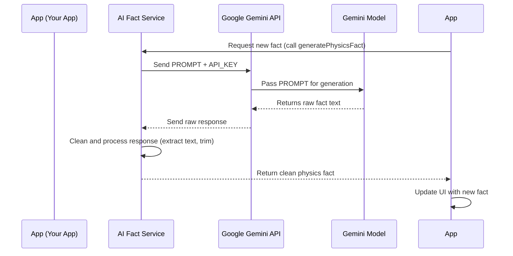

# Chapter 3: AI Fact Generation Service

Welcome back, intrepid explorer! In [Chapter 1: User Interface (UI)](tutorials/01_user_interface__ui__.md), we discovered the "cockpit" of `COSMIC-QUERIES`, and in [Chapter 2: Application State Management](tutorials/02_application_state_management_.md), we learned how the app keeps track of what's happening internally, deciding when to show a loading spinner, a fact, or an error.

But there's still a big question: Where do those amazing physics facts actually come from? How does our app conjure up new wonders of the universe? The answer lies in the **AI Fact Generation Service**.

## What is the AI Fact Generation Service?

Imagine `COSMIC-QUERIES` is a brilliant, curious student, but they don't know *every* physics fact. To get new information, they need to ask a super-smart professor who knows everything about physics. Our **AI Fact Generation Service** is like that highly specialized professor.

It's the "brain" of our application, responsible for communicating with a powerful **external Artificial Intelligence (AI) model** (in our case, Google Gemini). Its main job is to:

1.  **Understand what we need:** We ask for a "mind-blowing physics fact."
2.  **Talk to the AI:** It handles all the technical steps of sending our request to Google Gemini.
3.  **Process the AI's answer:** The AI might return extra information, so the service cleans up the response to give us *only* the fact.
4.  **Deliver a clean fact:** It ensures the main app receives a concise, ready-to-display statement, without any messy details.

This service acts as a **translator** and **gatekeeper** between our simple app and the complex world of AI. It makes sure our main app doesn't have to worry about the nitty-gritty details of talking to an AI model – it just asks for a fact and gets one!

## How the App Asks for a Fact

In [Chapter 2: Application State Management](tutorials/02_application_state_management_.md), we saw the `handleGenerateFact` function. This is where our app *requests* a new fact. Inside this function, there's a special line that calls our AI Fact Generation Service:

```typescript
// --- File: App.tsx (part of handleGenerateFact) ---
// ...
import { generatePhysicsFact } from './services/geminiService'; // Import our service!

const App: React.FC = () => {
  // ... state declarations ...

  const handleGenerateFact = useCallback(async () => {
    // ... loading state updates ...
    try {
      // This is where we ask the AI for a fact!
      const newFact = await generatePhysicsFact();
      setFact(newFact); // Update our app's 'fact' state
    } catch (e) {
      // ... error handling ...
    } finally {
      // ... loading state updates ...
    }
  }, [isLoading]);

  // ... rest of App.tsx ...
};
```

**Explanation:**
*   `import { generatePhysicsFact } from './services/geminiService';`: This line brings in the `generatePhysicsFact` function from a separate file. Think of it like calling a specific expert (our service) from your contact list.
*   `const newFact = await generatePhysicsFact();`: This is the crucial line.
    *   `generatePhysicsFact()`: This is the function in our service that does all the heavy lifting of talking to the AI.
    *   `await`: This keyword is like telling your computer, "Wait here! This might take a moment. Don't do anything else until `generatePhysicsFact()` has finished its job and given me the fact." This is important because talking to an AI over the internet takes time.
*   `setFact(newFact);`: Once `generatePhysicsFact()` returns the `newFact`, we use `setFact` (from [Chapter 2](tutorials/02_application_state_management_.md)) to update the app's internal memory. This automatically triggers the UI to display the new fact!

This single line (`await generatePhysicsFact();`) hides all the complexity of talking to an AI model, thanks to our specialized service.

## Inside the AI Fact Generation Service

Now, let's peek behind the curtain and see how `generatePhysicsFact()` actually works. This code lives in a separate file, `services/geminiService.ts`, keeping our main `App.tsx` clean and focused on the UI.

### Step 1: Your Secret Key (API_KEY)

To talk to Google Gemini, we need permission, like a special pass. This is an **API Key**. It's a secret code that identifies our application and ensures we're allowed to use the AI service.

```typescript
// --- File: services/geminiService.ts ---
import { GoogleGenAI } from "@google/genai";

const API_KEY = process.env.API_KEY;

if (!API_KEY) {
  // This error means you need to set up your API key!
  throw new Error("The API_KEY environment variable is not set.");
}

// ... rest of the service ...
```

**Explanation:**
*   `const API_KEY = process.env.API_KEY;`: We get our secret key from something called "environment variables." This is a secure way to store sensitive information without putting it directly into our code.
*   The `if` statement checks if the key is missing and stops the app if it is, reminding you to set it up.

### Step 2: Setting up the AI Connection

Once we have our key, we can create a "connection object" to talk to Google Gemini.

```typescript
// --- File: services/geminiService.ts ---
// ... (API_KEY definition) ...

const ai = new GoogleGenAI({ apiKey: API_KEY });

// ... rest of the service ...
```

**Explanation:**
*   `const ai = new GoogleGenAI({ apiKey: API_KEY });`: This line creates an `ai` object. Think of `ai` as our direct line or messenger service to Google's powerful AI. We give it our `API_KEY` so it knows we're authorized.

### Step 3: Crafting the "Prompt" (Our Question)

The most important part of talking to an AI is giving it clear instructions. This instruction is called a **prompt**. It's our specific question or command to the AI.

```typescript
// --- File: services/geminiService.ts ---
// ... (ai connection setup) ...

const PROMPT = `Generate a single, mind-blowing, surprising, and concise physics fact. 
The fact should be easy for a higher study student to understand but still scientifically accurate and intriguing. 
Present only the fact itself, without any introductory phrases like "Here's a fact:" or any conversational filler.
The fact should be a complete sentence or two.`;

// ... generatePhysicsFact function below ...
```

**Explanation:**
*   `const PROMPT = \`...\`;`: This long text string is our precise instruction. We tell the AI *exactly* what kind of fact we want (mind-blowing, surprising, concise) and how we want it formatted (just the fact, no extra words). Good prompts are key to getting good answers from AI!

### Step 4: Asking the AI and Getting the Response

Finally, the `generatePhysicsFact` function brings it all together to send the prompt to the AI and get its response.

```typescript
// --- File: services/geminiService.ts ---
// ... (PROMPT definition) ...

export async function generatePhysicsFact(): Promise<string> {
  try {
    const response = await ai.models.generateContent({
      model: 'gemini-2.5-flash', // The specific AI model we're using
      contents: PROMPT,          // Our detailed question/instruction
    });
    
    const text = response.text; // Extract the actual fact from the AI's response
    if (!text) {
        throw new Error("No content was returned from the AI.");
    }

    return text.trim(); // Clean up any extra spaces at the beginning/end
  } catch (error) {
    console.error("Error generating physics fact:", error);
    // ... more detailed error handling ...
    throw new Error("Failed to generate fact from AI service.");
  }
}
```

**Explanation:**
*   `export async function generatePhysicsFact(): Promise<string> { ... }`: This is the function that our `App.tsx` calls. `async` means it's an "asynchronous" function that might take some time to complete (because it's talking to an external service). `Promise<string>` tells us it will eventually give us a `string` (our fact).
*   `const response = await ai.models.generateContent({...});`: This is the heart of the interaction!
    *   `ai.models.generateContent`: This is the specific command to the Gemini AI to generate new content.
    *   `model: 'gemini-2.5-flash'`: We specify *which* Gemini model we want to use. 'gemini-2.5-flash' is a good, fast model for tasks like this.
    *   `contents: PROMPT`: We give it our carefully crafted `PROMPT`.
*   `const text = response.text;`: The AI responds with a lot of information, but `response.text` gives us just the generated text content – our physics fact!
*   `return text.trim();`: `.trim()` removes any extra spaces or newlines that the AI might have added, ensuring our fact is perfectly clean for display.
*   `try...catch`: This block is for handling potential problems. If anything goes wrong (like no internet connection, or the AI service is down), the `catch` part will run, allowing us to report an `error` to the user instead of crashing.

## The Journey of a Fact Request

Let's trace the journey from when you click the button to when a new fact appears on your screen, focusing on the AI Fact Generation Service's role:



In this flow:
1.  Your **App** (specifically `handleGenerateFact`) asks the **AI Fact Service** for a fact.
2.  The **AI Fact Service** prepares your `PROMPT` and `API_KEY` and sends them to the **Google Gemini API** (the gatekeeper for the Gemini AI).
3.  The **Google Gemini API** passes your request to the powerful **Gemini Model**, which is the actual "brain" that generates the text.
4.  The **Gemini Model** thinks hard and sends back the raw fact text to the **Google Gemini API**.
5.  The **Google Gemini API** then sends the complete (but still raw) response back to the **AI Fact Service**.
6.  The **AI Fact Service** then performs its "translator" job, extracting just the fact text and cleaning it up.
7.  Finally, the **AI Fact Service** returns the beautiful, clean physics fact back to your **App**.
8.  Your **App** then updates its state, causing the UI to display the new fact!

## Conclusion

In this chapter, we explored the "brain" of `COSMIC-QUERIES`: the **AI Fact Generation Service**. We learned that this service acts as a vital bridge between our app and a powerful external AI model like Google Gemini. It handles the complexities of secure access (`API_KEY`), clear communication (`PROMPT`), and careful processing of responses, ensuring that our app receives crisp, ready-to-display physics facts.

Understanding this service is key to seeing how our app brings the wonders of the cosmos directly to your screen! Next, we'll dive into how we make parts of our UI neat and reusable in [Chapter 4: Reusable UI Components](tutorials/04_reusable_ui_components_.md).

[Next Chapter: Reusable UI Components](tutorials/04_reusable_ui_components_.md)

---

<sub><sup>**References**: [[1]](https://github.com/santanu-p/COSMIC-QUERIES/blob/8a26b7fd4124f716cceb7d3148c370d080ff255b/App.tsx), [[2]](https://github.com/santanu-p/COSMIC-QUERIES/blob/8a26b7fd4124f716cceb7d3148c370d080ff255b/services/geminiService.ts)</sup></sub>