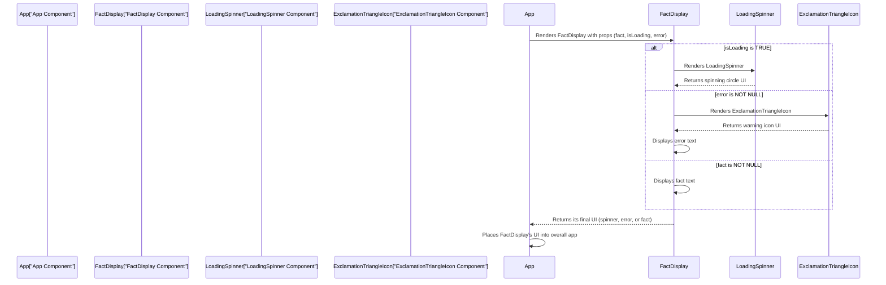

# Chapter 4: Reusable UI Components

Welcome back, intrepid explorer! In [Chapter 1: User Interface (UI)](tutorials/01_user_interface__ui__.md), we navigated the `COSMIC-QUERIES` cockpit, seeing all its controls and displays. In [Chapter 2: Application State Management](tutorials/02_application_state_management_.md), we learned how the app remembers things and updates its displays. And in [Chapter 3: AI Fact Generation Service](tutorials/03_ai_fact_generation_service_.md), we uncovered how those amazing physics facts are conjured up from the AI.

Now, let's talk about *how* we build the UI itself in a smart, efficient way. Imagine building with LEGO bricks. You don't build a new wheel every time you need one for a car, train, or robot. You just grab a pre-made wheel brick!

## What are Reusable UI Components?

Just like LEGO bricks, **Reusable UI Components** are independent, self-contained building blocks for our application's visual parts. They are pieces of UI that we design once and can then use multiple times throughout our app, wherever they are needed.

Think of them as small, specialized "mini-apps" that focus on just one thing. For example, a "button component" only knows how to be a button, and a "loading spinner component" only knows how to show a spinning animation.

In `COSMIC-QUERIES`, we use several reusable components:

*   **`SparklesIcon`**: A small icon with a sparkly look.
*   **`ExclamationTriangleIcon`**: A warning icon, used for errors.
*   **`LoadingSpinner`**: The spinning animation you see when the app is busy.
*   **`FactDisplay`**: The main box that shows the fact, loading spinner, or error message. This component is actually a larger "container" of other smaller components!

Using these components brings great benefits:

*   **Consistency:** Every `SparklesIcon` looks and behaves exactly the same, no matter where it appears. This makes our app feel polished.
*   **Efficiency:** We write the code for `LoadingSpinner` once, and then we can use it in `FactDisplay` (or anywhere else we might need a spinner) without writing the code again.
*   **Easier Maintenance:** If we want to change the color of all `SparklesIcon`s, we only change the code in *one place* (the `SparklesIcon` component definition), and every `SparklesIcon` in the app updates automatically!

## How to Use a Reusable Component (Like a LEGO Brick)

Using a component is super simple. Once a component is defined, you can "place" it in your UI just like a custom HTML tag.

Let's look at how we use `SparklesIcon` in our "Reveal New Fact" button (from `App.tsx`):

```typescript
// --- File: App.tsx (simplified) ---
// ...
// Remember this is how we make our component available:
import { SparklesIcon } from './App'; // (In actual code, it's defined within App.tsx or imported if separate)

const App: React.FC = () => {
  // ... state and functions ...

  return (
    <div className="...">
      {/* ... other parts of the app ... */}
      <button className="...">
         <SparklesIcon className="w-6 h-6 mr-3" /> {/* Here it is! */}
         <span>Reveal New Fact</span>
      </button>
      {/* ... */}
    </div>
  );
};
```
**Explanation:**
*   `import { SparklesIcon } from './App';`: This line (or if defined directly in `App.tsx` as in our case) makes the `SparklesIcon` component available for use. It's like taking a specific LEGO brick out of its box.
*   `<SparklesIcon className="w-6 h-6 mr-3" />`: This is how we "use" or "render" the component. It's almost like writing an HTML tag, but it's a special React component.
*   `className="w-6 h-6 mr-3"`: This is an example of passing a **prop** to the component. `props` are how we give instructions or data to a component. Here, we're telling `SparklesIcon` how big it should be and its spacing. (More on props next!).

## Giving Instructions with `Props`

Sometimes, a component needs specific information to do its job or look a certain way. This information is passed using **props** (short for "properties"). Think of `props` as the little customizable studs or holes on a LEGO brick that let you attach other bricks or change its color.

Let's look at `FactDisplay` as a prime example:

```typescript
// --- File: App.tsx (simplified) ---
// ...
import { FactDisplay } from './App'; // (Again, defined in App.tsx)

const App: React.FC = () => {
  const [fact, setFact] = useState<string | null>(null);
  const [isLoading, setIsLoading] = useState<boolean>(true);
  const [error, setError] = useState<string | null>(null);
  // ... calculate isCardLoading ...

  return (
    <div className="...">
      {/* ... header ... */}
      <FactDisplay 
        fact={fact} 
        isLoading={isCardLoading} 
        error={error} 
      /> {/* FactDisplay component with props */}
      {/* ... button and footer ... */}
    </div>
  );
};
```
**Explanation:**
*   `fact={fact}`: We pass the value of our `fact` state variable (from [Chapter 2: Application State Management](tutorials/02_application_state_management_.md)) to the `FactDisplay` component.
*   `isLoading={isCardLoading}`: We pass the `isCardLoading` state variable.
*   `error={error}`: We pass the `error` state variable.

The `FactDisplay` component then uses these `props` to decide what content to show inside itself: a loading spinner, an error message, or the actual fact.

## How Reusable Components Work Internally

To truly understand components, let's peek inside their "blueprints."

Imagine a component as a mini-function that returns a piece of UI. When you use `<ComponentName prop1={value1} />`, React calls that function, giving it the `props` you provided. The function then returns the visual elements (like `div`s, `p` tags, `svg`s, or even *other components*) that should appear on the screen.

Here's a simplified flow for our `FactDisplay` component:



In this diagram:
1.  The **App Component** decides to show the **FactDisplay Component** and sends it `fact`, `isLoading`, and `error` as `props`.
2.  The **FactDisplay Component** acts like a smart display:
    *   If `isLoading` is true, it asks the **LoadingSpinner Component** to show its UI.
    *   If there's an `error`, it asks the **ExclamationTriangleIcon Component** to show its UI and then displays the error text itself.
    *   Otherwise, it simply displays the `fact` text.
3.  Whatever the **FactDisplay Component** decides to show (spinner, error, or fact), it then sends that finished piece of UI back to the **App Component**.
4.  The **App Component** then puts that final UI into its overall layout for you to see.

### Looking at the Component Blueprints

Let's see how these components are actually defined in `App.tsx`.

#### 1. `SparklesIcon` (Simplest Example)

```typescript
// --- File: App.tsx (part of) ---
const SparklesIcon: React.FC<{ className?: string }> = ({ className }) => (
  <svg xmlns="http://www.w3.org/2000/svg" viewBox="0 0 24 24" fill="currentColor" className={className}>
    {/* ... actual SVG path data ... */}
  </svg>
);
```
**Explanation:**
*   `const SparklesIcon: React.FC<{ className?: string }> = ({ className }) => (...)`: This defines `SparklesIcon` as a React Function Component (`React.FC`).
    *   `{ className?: string }` tells us that it can optionally accept a `className` prop, which should be a text string.
    *   `({ className }) =>` means it receives `className` from its `props`.
*   The component simply returns an `<svg>` tag. The `className` prop is directly applied to the `svg`, allowing us to control its size and color from where we use it (`<SparklesIcon className="w-6 h-6" />`).

#### 2. `LoadingSpinner`

```typescript
// --- File: App.tsx (part of) ---
const LoadingSpinner: React.FC = () => (
  <div className="flex justify-center items-center">
    <div className="animate-spin rounded-full h-12 w-12 border-b-2 border-cyan-400"></div>
  </div>
);
```
**Explanation:**
*   `const LoadingSpinner: React.FC = () => (...)`: This component doesn't need any special information, so it doesn't take any `props`.
*   It returns `div` elements that create the spinning circle animation using CSS styles.

#### 3. `FactDisplay` (Putting it all together)

This component is a bit more complex because it uses other components and conditional logic.

```typescript
// --- File: App.tsx (part of) ---
// ... (imports for ExclamationTriangleIcon, LoadingSpinner) ...

interface FactDisplayProps {
  fact: string | null;
  isLoading: boolean;
  error: string | null;
}

const FactDisplay: React.FC<FactDisplayProps> = ({ fact, isLoading, error }) => (
  <div className="relative group">
    {/* ... outer styling divs ... */}
    <div className="relative min-h-[250px] bg-black rounded-lg p-6 flex items-center justify-center text-center leading-loose">
        {isLoading ? ( // If isLoading is true...
          <LoadingSpinner /> // ...show the spinner component
        ) : error ? ( // Else, if there's an error...
          <div className="flex flex-col items-center gap-4 text-red-400 animate-fade-in">
            <ExclamationTriangleIcon className="w-12 h-12" /> {/* ...show the error icon */}
            <p className="font-medium text-lg">{error}</p> {/* ...and the error text */}
          </div>
        ) : ( // Else (meaning no loading, no error, so there's a fact)...
          <p className="text-xl md:text-2xl font-light text-gray-200 animate-fade-in">
            {fact} {/* ...show the actual fact */}
          </p>
        )}
    </div>
  </div>
);
```
**Explanation:**
*   `interface FactDisplayProps { ... }`: This defines the "type" of `props` that `FactDisplay` expects: `fact` (text or null), `isLoading` (true/false), and `error` (text or null). This helps ensure we pass the right information.
*   `({ fact, isLoading, error }) => (...)`: This is how the component "receives" the `props` that were sent to it from `App.tsx`.
*   The heart of `FactDisplay` is the conditional rendering logic:
    *   `isLoading ? (<LoadingSpinner />)`: If `isLoading` is `true`, it renders the `LoadingSpinner` component.
    *   `: error ? (...)`: If `isLoading` is `false`, it then checks if `error` exists. If so, it renders the `ExclamationTriangleIcon` and the `error` text.
    *   `: (...)`: If neither `isLoading` nor `error` is true, it renders the `<p>` tag with the `fact`.

This `FactDisplay` component effectively packages up all the logic for showing different states (loading, error, fact) into one neat, reusable box.

## Conclusion

In this chapter, we learned about the power of **Reusable UI Components**. We discovered that they are like versatile LEGO bricks that allow us to build complex user interfaces efficiently, consistently, and easily maintainable. We saw how components like `SparklesIcon`, `LoadingSpinner`, `ExclamationTriangleIcon`, and the `FactDisplay` itself are defined and used, and how `props` allow us to pass data and instructions to them.

By breaking down our UI into smaller, focused components, `COSMIC-QUERIES` becomes much easier to understand and extend. Now that we understand all the pieces of our app, the final step is to learn how to prepare and run our `COSMIC-QUERIES` project on your computer! That's what we'll cover in the next chapter.

[Next Chapter: Build and Environment Configuration](tutorials/05_build_and_environment_configuration_.md)

---

<sub><sup>**References**: [[1]](https://github.com/santanu-p/COSMIC-QUERIES/blob/8a26b7fd4124f716cceb7d3148c370d080ff255b/App.tsx)</sup></sub>