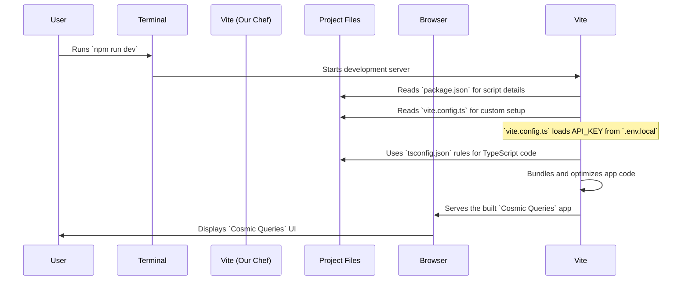

# Chapter 5: Build and Environment Configuration

Welcome back, curious mind! In our journey through `COSMIC-QUERIES`, we've explored the amazing [User Interface (UI)](01_user_interface__ui__.md), understood how the app manages its [Application State](02_application_state_management_.md), unveiled the secrets of the [AI Fact Generation Service](03_ai_fact_generation_service_.md), and learned how we build the UI using [Reusable UI Components](04_reusable_ui_components_.md).

Now, imagine you've gathered all the perfect ingredients for a delicious cake (your code files, UI components, AI service). You have the recipe, but how do you actually *bake* it? How do you prepare it so it can be served hot and fresh from the oven, ready for anyone to enjoy?

This is where **Build and Environment Configuration** comes in. It's like the "kitchen" and "oven" for our software project. It defines all the rules, tools, and settings needed to turn our raw code into a working application that can run on your computer or be shared with the world.

## What Problem Does This Solve?

Our `COSMIC-QUERIES` app is made of many different pieces:
*   TypeScript files (`.ts`, `.tsx`) for our code
*   CSS for styling
*   HTML for the basic page structure
*   Images, icons, etc.

Web browsers, however, can't directly understand TypeScript or some of the advanced features we use. They need everything converted into plain JavaScript, CSS, and HTML, optimized for speed. Also, our app needs to securely access things like the AI's secret key (`API_KEY`) without showing it to everyone.

**Build and Environment Configuration** solves these problems by providing:
1.  **A "Chef" (Vite):** A powerful tool that takes all our ingredients, processes them, and bakes them into a ready-to-serve application.
2.  **A "Recipe Book" (`package.json`):** Lists all the project's dependencies (other code libraries it needs) and provides common "cooking" commands.
3.  **"Language Rules" (`tsconfig.json`):** Helps our "Chef" understand how to handle our TypeScript code.
4.  **"Secret Ingredient List" (`.env.local`):** Stores sensitive information like our `API_KEY` securely.
5.  **"Special Instructions" (`vite.config.ts`):** Custom commands for our "Chef" on how to handle specific parts of the building process.

By understanding these, you'll know how to get `COSMIC-QUERIES` running on your own computer!

## The Central Use Case: Running COSMIC-QUERIES Locally

The most important task for anyone getting started with `COSMIC-QUERIES` is to make it run on their own machine. This is called "running locally." Our project's `README.md` file gives you the simple instructions for this:

```markdown
# Run and deploy your AI Studio app

This contains everything you need to run your app locally.

## Run Locally

**Prerequisites:**  Node.js


1. Install dependencies:
   `npm install`
2. Set the `GEMINI_API_KEY` in [.env.local](.env.local) to your Gemini API key
3. Run the app:
   `npm run dev`
```
Let's break down what each of these steps means from a "Build and Environment Configuration" perspective.

## Key Concepts Explained

### 1. `npm install`: Gathering All the Tools

Before you start baking, you need your tools and ingredients!

*   **`npm`**: This stands for "Node Package Manager." It's a tool that helps you download and manage all the pre-written code (called "packages" or "libraries") that our project needs.
*   **`npm install`**: When you run this command, `npm` looks at our project's "recipe book" (`package.json`) to see what other code libraries `COSMIC-QUERIES` relies on. It then downloads all of them and puts them in a special folder called `node_modules`. These include libraries like React, Vite, and the Google Gemini AI library.

### 2. Setting up the Secret Key: `.env.local`

Remember our [AI Fact Generation Service](03_ai_fact_generation_service_.md) needed a secret `API_KEY` to talk to Google Gemini? This key is *sensitive* information, like a password. You never want to put passwords directly into your main code files because they might accidentally get shared.

This is where **Environment Variables** and the `.env.local` file come in.

*   **Environment Variables**: Think of these as special labels on the "kitchen door" that only certain parts of the `COSMIC-QUERIES` app can read. They are separate from your main code.
*   **`.env.local`**: This is a plain text file where we store these secret labels and their values. The `.local` part means it's only used on *your* local computer and is typically ignored when you share your code online (so your secret key stays secret!).

To set your key, you simply open the `.env.local` file (if it doesn't exist, create it in the main project folder) and add this line:

```
GEMINI_API_KEY=YOUR_ACTUAL_GEMINI_API_KEY_HERE
```
**Explanation:**
*   `GEMINI_API_KEY`: This is the name of our environment variable.
*   `YOUR_ACTUAL_GEMINI_API_KEY_HERE`: You'll replace this with the real API key you get from Google.

This key is then magically made available to your app during the build process, which we'll see next!

### 3. `npm run dev`: Starting the Development Server

This is the command that truly brings `COSMIC-QUERIES` to life on your machine!

*   **`npm run dev`**: This command tells `npm` to look in `package.json` again, find the `dev` script, and execute it.
*   **Vite**: The `dev` script actually runs `vite`. Vite is our super-fast "Chef" and "Oven" combined. It does several things:
    *   **Bundling:** It takes all your separate TypeScript, CSS, and other files and combines them into optimized bundles that browsers can understand quickly.
    *   **Transpiling:** It converts modern TypeScript/JavaScript code into older versions that more browsers can understand.
    *   **Hot Module Replacement (HMR):** This is a cool feature! If you make a change to your code while the app is running, Vite automatically updates the browser *without you having to refresh the page*. It's like having a super-smart assistant who constantly updates your recipe in the oven without you lifting a finger.
    *   **Development Server:** It creates a small web server on your computer that serves your app to your web browser (usually at `http://localhost:5173/`).

When you run `npm run dev`, you'll see messages in your terminal indicating that Vite is starting up and providing a local address where you can access your app in your browser.

## The Journey from `npm run dev` to Your Browser

Let's visualize the process when you run `npm run dev`:



## Diving Deeper: The Project's Configuration Files

Let's peek into the actual files that guide this entire process.

### 1. `package.json`: The Project's Recipe Book

This file is a central hub for any Node.js/JavaScript project.

```json
{
  "name": "cosmic-queries",
  "private": true,
  "version": "0.0.0",
  "type": "module",
  "scripts": {
    "dev": "vite",
    "build": "vite build",
    "preview": "vite preview"
  },
  "dependencies": {
    "react": "^19.1.0",
    "react-dom": "^19.1.0",
    "@google/genai": "^1.8.0"
  },
  "devDependencies": {
    "@types/node": "^22.14.0",
    "typescript": "~5.7.2",
    "vite": "^6.2.0"
  }
}
```
**Explanation:**
*   **`name`**, **`version`**: Basic information about our project.
*   **`scripts`**: This is where we define common commands.
    *   `"dev": "vite"`: When you run `npm run dev`, it actually runs the `vite` command. This starts our development server.
    *   `"build": "vite build"`: This command tells Vite to prepare the app for "production" (for sharing with others). It creates highly optimized files that are ready to be uploaded to a web server.
    *   `"preview": "vite preview"`: This command lets you quickly check how your "production" build looks without needing a full web server.
*   **`dependencies`**: These are the libraries our *app needs to run*.
    *   `react`, `react-dom`: The core libraries for building our UI.
    *   `@google/genai`: The library that helps our [AI Fact Generation Service](03_ai_fact_generation_service_.md) talk to Google Gemini.
*   **`devDependencies`**: These are libraries our *development process needs*, but not the final running app itself.
    *   `typescript`: The language we write our code in.
    *   `vite`: Our build tool.

### 2. `tsconfig.json`: TypeScript's Rulebook

This file tells the TypeScript compiler (and Vite, which uses TypeScript) how to understand and convert our TypeScript code.

```json
{
  "compilerOptions": {
    "target": "ES2020",
    "module": "ESNext",
    "lib": ["ES2020", "DOM", "DOM.Iterable"],
    "jsx": "react-jsx",
    "strict": true,
    "paths": {
      "@/*" :  ["./*"]
    },
    // ... many other technical options ...
  }
}
```
**Explanation (Simplified):**
*   This file ensures that our TypeScript code is correctly interpreted and converted into standard JavaScript.
*   `"jsx": "react-jsx"`: This tells TypeScript how to handle our React UI code (like `<FactDisplay />`).
*   `"strict": true`: This enforces strict type-checking, which helps catch errors early and makes our code more reliable.
*   `"paths": { "@/*" : ["./*"] }`: This is a helpful shortcut! It means we can write `import { someFunction } from '@/utils/helpers';` instead of `import { someFunction } from '../../utils/helpers';`. It helps keep our import paths cleaner.

### 3. `vite.config.ts`: Vite's Custom Instructions

This is where we give Vite specific commands for our project.

```typescript
import { defineConfig, loadEnv } from 'vite';

export default defineConfig(({ mode }) => {
    const env = loadEnv(mode, '.', ''); // Load environment variables
    return {
      define: {
        // Make GEMINI_API_KEY available to our app code
        'process.env.API_KEY': JSON.stringify(env.GEMINI_API_KEY),
        'process.env.GEMINI_API_KEY': JSON.stringify(env.GEMINI_API_KEY)
      },
      // ... other settings ...
    };
});
```
**Explanation:**
*   `import { defineConfig, loadEnv } from 'vite';`: We import helper functions from Vite.
*   `loadEnv(mode, '.', '')`: This is the crucial part for environment variables! It tells Vite to find environment variables (like `GEMINI_API_KEY`) from files like `.env.local` based on the current mode (e.g., "development" or "production").
*   `define: { 'process.env.API_KEY': JSON.stringify(env.GEMINI_API_KEY) }`: This is how our secret key gets into our app's code.
    *   It creates a global variable called `process.env.API_KEY` (and `process.env.GEMINI_API_KEY`) within our application.
    *   The `JSON.stringify` makes sure the value is treated as a string.
    *   Now, in our [AI Fact Generation Service](03_ai_fact_generation_service_.md) (`services/geminiService.ts`), when we write `const API_KEY = process.env.API_KEY;`, it can successfully read the value you set in `.env.local`! This is the bridge that connects your secret key to the part of the code that needs it.

This setup ensures that sensitive API keys are securely managed and only accessed during the build process, never exposed in your public code.

## Conclusion

In this final chapter, we've explored the "engineering blueprint" and "assembly line" for `COSMIC-QUERIES`: **Build and Environment Configuration**. We learned how tools like Vite, along with configuration files like `package.json`, `tsconfig.json`, `.env.local`, and `vite.config.ts`, work together to transform our raw code into a runnable application.

You now understand the magic behind `npm install` for gathering tools, how to securely manage your `API_KEY` with `.env.local`, and what happens when you run `npm run dev` to launch the app. This knowledge empowers you to set up, run, and even prepare `COSMIC-QUERIES` for deployment, bringing the wonders of physics to life on any screen!

Congratulations on completing your journey through the `COSMIC-QUERIES` tutorial! We hope you've enjoyed learning how this fascinating application works under the hood.

---

<sub><sup>**References**: [[1]](https://github.com/santanu-p/COSMIC-QUERIES/blob/8a26b7fd4124f716cceb7d3148c370d080ff255b/README.md), [[2]](https://github.com/santanu-p/COSMIC-QUERIES/blob/8a26b7fd4124f716cceb7d3148c370d080ff255b/package.json), [[3]](https://github.com/santanu-p/COSMIC-QUERIES/blob/8a26b7fd4124f716cceb7d3148c370d080ff255b/tsconfig.json), [[4]](https://github.com/santanu-p/COSMIC-QUERIES/blob/8a26b7fd4124f716cceb7d3148c370d080ff255b/vite.config.ts)</sup></sub>
